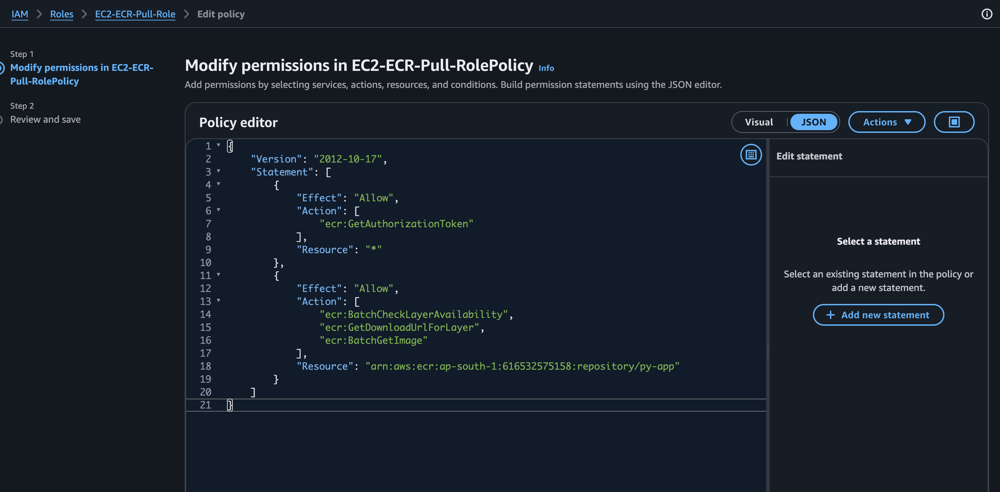
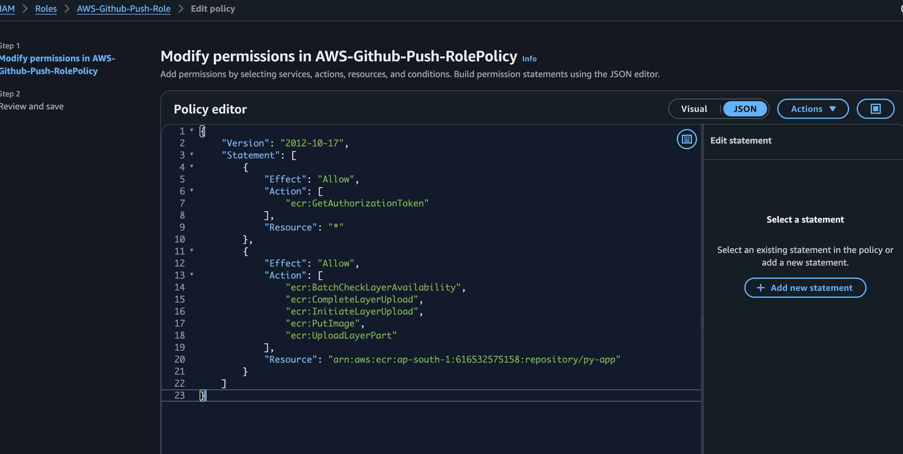
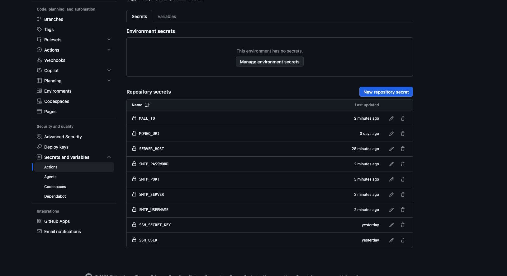
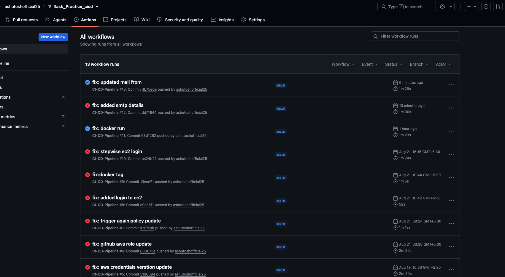
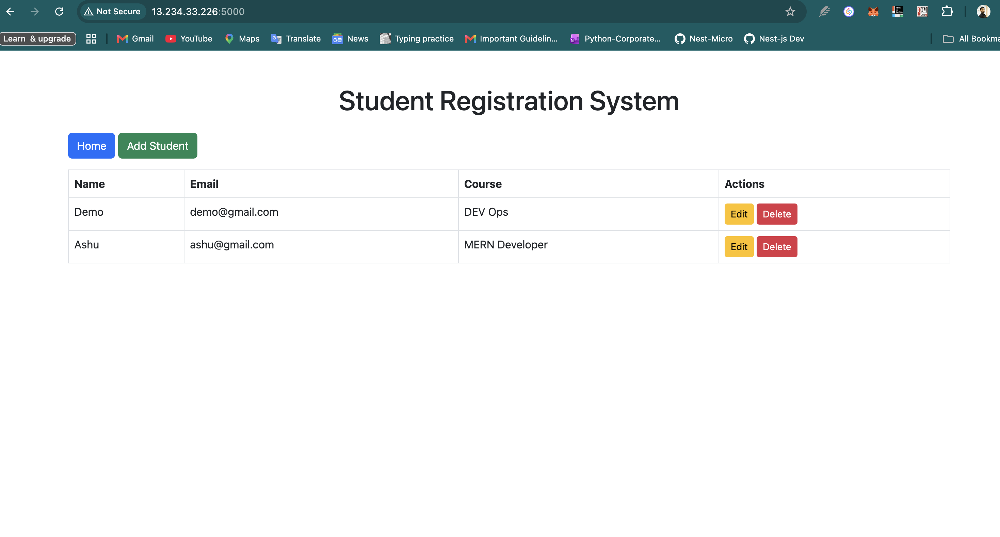
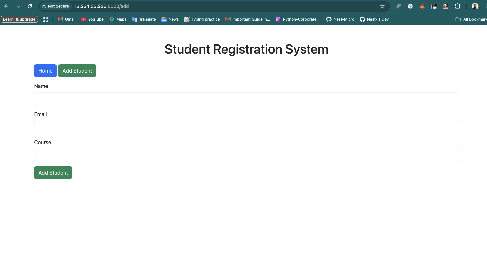
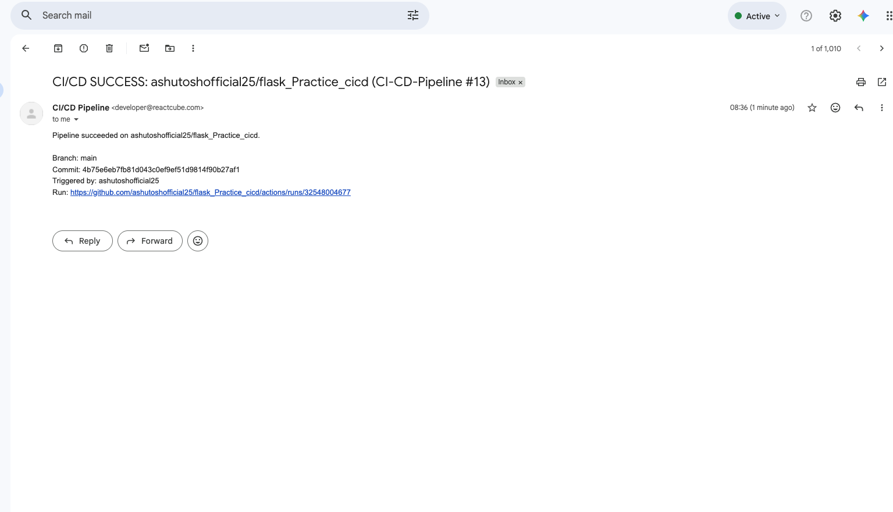

# Student Registration System

A simple **Flask** web application to manage student records with **MongoDB** as the backend database. Users can **add, view, update, and delete** student details. The project also demonstrates a full **CI/CD pipeline** that tests, builds, and deploys the app to an **AWS EC2** instance via **Amazon ECR**, using **GitHub OIDC** (no static AWS keys) and **email notifications** on pipeline success/failure.

---

## Features

* List all students on the home page
* Add a new student
* Update existing student details
* Delete a student with confirmation
* Simple and responsive UI using Bootstrap
* `/health` endpoint that pings MongoDB for liveness checks
* Fully automated CI/CD pipeline (test → build → push → deploy → notify)

---

## Tech Stack

* **Backend:** Python, Flask
* **Database:** MongoDB (via Flask-PyMongo)
* **Frontend:** HTML, Jinja2 templates, Bootstrap 5
* **Environment Variables:** Managed via `.env` file
* **Container:** Docker
* **Registry:** Amazon ECR
* **Compute:** AWS EC2
* **CI/CD:** GitHub Actions (with OIDC federation into AWS) + an alternate Azure Pipelines definition
* **Notifications:** SMTP email on pipeline success/failure

---

## Setup Instructions

### 1. Clone the repository

```bash
git clone <your-repo-url>
cd <repo-folder>
```

### 2. Create and activate a virtual environment

```bash
python -m venv venv
# Activate venv
# Windows:
venv\Scripts\activate
# Linux / Mac:
source venv/bin/activate
```

### 3. Install dependencies

```bash
pip install -r requirements.txt
```

### 4. Configure environment variables

Create a `.env` file in the project root:

```
MONGO_URI=<your-mongodb-connection-string>
SECRET_KEY=<your-secret-key>
```

### 5. Run the application

```bash
python app.py
```

Open your browser at: [http://localhost:5000](http://localhost:5000)

You can verify the app + database connection any time via:

```bash
curl http://localhost:5000/health
```

---

## Running with Docker

The included [Dockerfile](Dockerfile) builds a lightweight image from `python:3.9-slim`, installs dependencies, and runs the app on port `5000`:

```bash
docker build -t py-app .
docker run -d -p 5000:5000 --name py-app -e MONGO_URI="<your-mongodb-connection-string>" py-app
```

---

## Project Structure

```
flask_Practice_cicd/
│
├── .github/workflows/
│   └── ci.yaml                # GitHub Actions CI/CD pipeline
├── configs/
│   ├── github-oidc-role-trust-policy.json   # Trust policy for the OIDC IAM role
│   ├── github-oidc-role.json                # Permissions policy: push image to ECR
│   └── push-role.json                       # Permissions policy used by the EC2 pull role
├── screenshorts/                # Pipeline / infra screenshots referenced below
├── templates/
│   ├── base.html
│   ├── index.html
│   ├── add_student.html
│   └── update_student.html
├── app.py                       # Flask application
├── test_app.py                  # Pytest test suite (runs in CI)
├── Dockerfile                   # Container image definition
├── aws-ecr.sh                   # Manual ECR login/build/push helper script
├── azure-pipelines.yml          # Alternate CI definition for Azure DevOps
├── requirements.txt
└── .env                          # Local secrets (not committed)
```

---

## CI/CD Pipeline (GitHub Actions)

Workflow file: [.github/workflows/ci.yaml](.github/workflows/ci.yaml)

The pipeline runs on every push to `main` and performs the following steps end-to-end:

| # | Step | What it does |
|---|------|---------------|
| 1 | **Checkout code** | `actions/checkout@v2` pulls the repo into the runner |
| 2 | **Set up Python** | `actions/setup-python@v2` installs Python `3.8` |
| 3 | **Install dependencies** | `pip install -r requirements.txt` |
| 4 | **Run tests** | Runs `pytest` (`test_app.py`) against a real `MONGO_URI` pulled from GitHub Secrets |
| 5 | **Configure AWS credentials** | `aws-actions/configure-aws-credentials@v4` assumes `arn:aws:iam::616532575158:role/AWS-Github-Push-Role` via **OIDC** — no long-lived AWS access keys are stored in GitHub |
| 6 | **Log in to Amazon ECR** | `aws ecr get-login-password` + `docker login` against `616532575158.dkr.ecr.ap-south-1.amazonaws.com` |
| 7 | **Build Docker image** | `docker build -t py-app .` using the [Dockerfile](Dockerfile) |
| 8 | **Tag & push image** | Tags the image `py-app:latest` and pushes it to the `py-app` ECR repository |
| 9 | **Write SSH key** | Writes the `SSH_SECRET_KEY` secret to `~/.ssh/deploy_key` (mode `600`) so the runner can reach the EC2 host |
| 10 | **Log in to ECR on EC2** | SSHes into the EC2 host (`SSH_USER@SERVER_HOST`) and logs the instance's Docker daemon in to ECR |
| 11 | **Pull & redeploy on EC2** | Pulls the new image, stops/removes the old `py-app` container, and starts the new one with `MONGO_URI` injected as an env var, mapped to port `5000` |
| 12 | **Health check** | Waits 10s, then `curl`s `http://$SERVER_HOST:5000/health` — fails the job if the container/DB isn't healthy |
| 13 | **Email on success / failure** | `dawidd6/action-send-mail@v3` sends an SMTP email with repo, branch, commit SHA, actor, and a link to the run — the subject/body differ for the `success()` and `failure()` branches |

### Permissions

```yaml
permissions:
  id-token: write   # required to request the OIDC token used to assume the AWS role
  contents: read
```

### Required GitHub Secrets

| Secret | Used for |
|--------|----------|
| `MONGO_URI` | MongoDB connection string, used both for running tests and for the deployed container |
| `SSH_SECRET_KEY` | Private key to SSH into the EC2 deployment host |
| `SSH_USER` | SSH username on the EC2 host |
| `SERVER_HOST` | EC2 host/IP to deploy to and health-check |
| `SMTP_SERVER`, `SMTP_PORT`, `SMTP_USERNAME`, `SMTP_PASSWORD` | SMTP credentials for pipeline notification emails |
| `MAIL_TO` | Notification recipient |
| `MAIL_FROM` *(optional)* | Notification "from" address; falls back to `SMTP_USERNAME` if unset |

No AWS access key/secret is stored as a GitHub secret — the AWS step authenticates purely via the OIDC role below. See the **Actions-secret.png** screenshot in the walkthrough section for how these are configured in the GitHub UI.

---

## AWS IAM / OIDC Configuration

To let GitHub Actions assume an AWS role without static credentials, the AWS account trusts GitHub's OIDC provider (`token.actions.githubusercontent.com`).

### 1. Trust policy — [`configs/github-oidc-role-trust-policy.json`](configs/github-oidc-role-trust-policy.json)

Attached to the `AWS-Github-Push-Role` role. It allows any workflow run from repos owned by GitHub user `ashutoshofficial25` to assume the role via `sts:AssumeRoleWithWebIdentity`, scoped to the `sts.amazonaws.com` audience:

```json
{
  "Version": "2012-10-17",
  "Statement": [
    {
      "Effect": "Allow",
      "Principal": {
        "Federated": "arn:aws:iam::616532575158:oidc-provider/token.actions.githubusercontent.com"
      },
      "Action": "sts:AssumeRoleWithWebIdentity",
      "Condition": {
        "StringEquals": {
          "token.actions.githubusercontent.com:aud": "sts.amazonaws.com"
        },
        "StringLike": {
          "token.actions.githubusercontent.com:sub": [
            "repo:ashutoshofficial25@*",
            "repo:ashutoshofficial25/*"
          ]
        }
      }
    }
  ]
}
```

Screenshot: **02-Github-Role-for-OIDC.png** below shows this role/provider set up in the AWS console.

### 2. Push permissions — [`configs/github-oidc-role.json`](configs/github-oidc-role.json)

Permissions policy attached to `AWS-Github-Push-Role`, scoped to the `py-app` ECR repository only:

```json
{
  "Version": "2012-10-17",
  "Statement": [
    { "Effect": "Allow", "Action": ["ecr:GetAuthorizationToken"], "Resource": "*" },
    {
      "Effect": "Allow",
      "Action": [
        "ecr:BatchCheckLayerAvailability",
        "ecr:CompleteLayerUpload",
        "ecr:InitiateLayerUpload",
        "ecr:PutImage",
        "ecr:UploadLayerPart"
      ],
      "Resource": "arn:aws:ecr:ap-south-1:616532575158:repository/py-app"
    }
  ]
}
```

This grants **push-only** access (build/tag/push image layers) — no pull, delete, or repository-management permissions.

### 3. EC2 pull permissions — [`configs/push-role.json`](configs/push-role.json)

Same shape of policy, attached to the **instance role** on the EC2 host so it can authenticate to ECR and `docker pull` the freshly-pushed image during the deploy step.

Screenshot: **01-EC2-ECR-Pull-role.png** below shows this instance role in the AWS console.

---

## Alternate pipeline: Azure DevOps

[`azure-pipelines.yml`](azure-pipelines.yml) is a parallel, simpler CI definition for running the test suite on a self-hosted Azure DevOps agent pool (`Test1`):

1. Installs Python `3.13`
2. Installs dependencies from `requirements.txt`
3. Runs `pytest tests/ --junitxml=junit/test-results.xml`
4. Publishes the JUnit test results via `PublishTestResults@2`

This pipeline only covers **testing**, not build/push/deploy — those stages live in the GitHub Actions workflow above.

---

## Manual ECR build/push (`aws-ecr.sh`)

For local/manual pushes outside of CI, [`aws-ecr.sh`](aws-ecr.sh) reproduces steps 6–8 of the pipeline:

```bash
aws ecr get-login-password --region ap-south-1 | \
  docker login --username AWS --password-stdin 616532575158.dkr.ecr.ap-south-1.amazonaws.com

docker build -t py-app .

docker tag py-app:latest 616532575158.dkr.ecr.ap-south-1.amazonaws.com/py-app:latest
docker push 616532575158.dkr.ecr.ap-south-1.amazonaws.com/py-app:latest
```

---

## Screenshots — Step by Step Walkthrough

All images live in [`screenshorts/`](screenshorts/).

### 1. AWS IAM — EC2 ECR pull role
The instance role attached to the EC2 host, granted `ecr:GetAuthorizationToken` + pull-related permissions so the deployed container can be pulled from ECR at deploy time.



### 2. AWS IAM — GitHub OIDC role
The `AWS-Github-Push-Role` IAM role with the OIDC trust relationship (`github-oidc-role-trust-policy.json`) and push permissions (`github-oidc-role.json`) that the GitHub Actions workflow assumes at runtime — no static AWS keys required.



### 3. GitHub Actions — repository secrets
The secrets configured under **Settings → Secrets and variables → Actions**, consumed by [`ci.yaml`](.github/workflows/ci.yaml) (`MONGO_URI`, `SSH_SECRET_KEY`, `SSH_USER`, `SERVER_HOST`, SMTP credentials, `MAIL_TO`).



### 4. GitHub Actions — pipeline run history
A successful end-to-end run of the `CI-CD-Pipeline` workflow: tests → AWS login → ECR push → SSH deploy → health check → notification email.



### 5. Deployed app running on EC2
The Flask app served from the Docker container running on the EC2 instance after the pipeline's deploy step, showing the student list home page.




### 6. Pipeline success notification email
The SMTP email sent by the `Email on success` step, confirming the pipeline finished and the app was redeployed, with repo/branch/commit/run details.



---

## Notes

* Make sure MongoDB is running and accessible via the URI in `.env`
* Delete action includes a confirmation page to prevent accidental deletion
* Uses `ObjectId` from `bson` to work with MongoDB document IDs
* If you use MongoDB Atlas on macOS, install dependencies again (`pip install -r requirements.txt`). This project now uses `certifi` CA bundle explicitly to avoid common TLS certificate verification failures with `pymongo`.
* The GitHub Actions role and EC2 instance role each follow least-privilege: push-only vs. pull-only ECR access on the single `py-app` repository.
* Rotate `SSH_SECRET_KEY` and SMTP credentials periodically; the AWS side never needs key rotation since it's OIDC-based.

---

## License

MIT License
